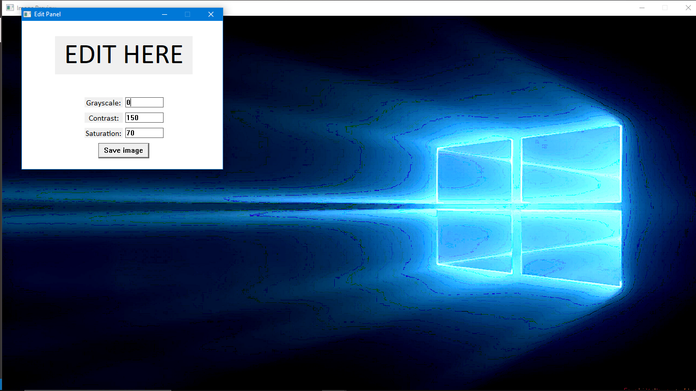
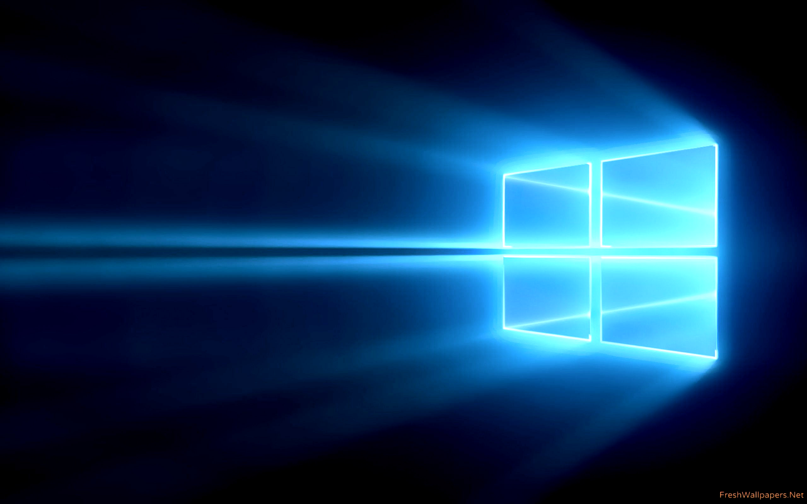

# Fotosop
>_**"The fastest pixel processor in the west..."**_

## About
A simple program to modify the contrast and saturation of an image, as well as apply a greyscale filter. The program uses the [OpenCL library](https://github.com/KhronosGroup/OpenCL-SDK) for GPU processing and the [stb library](https://github.com/nothings/stb) for image processing.

## How To Run
I have made 2 programs. Choose the one that suits you.
1. **GUI**: click and open the executable `Fotosop.exe`. **This is Windows only.**
2. **Command line:** depending on OS,
- For **Windows**, run the executable `Fotosop(CLI).exe`.
- For **Unix**, run `Fotosop`. 

If you are on **MacOS,** unfortunately **I did not prepare an executable, sorry**. You can, however, compile [mainCLI.c](src/mainCLI.c) (located in `src` folder) with the following flags for gcc:

```
gcc "mainCLI.c" -o Fotosop -lm -lOpenCL -Wno-deprecated-declarations
```

There is no other dependencies and MacOS should already support OpenCL, so the above command should _probably_ work.

## How To Use

### **GUI**:

You can just watch this if you don't want to read the instructions. Click the GIF to watch from the beginning (if it hasn't loaded wait 3 seconds).


**Instructions**

0. The program is safe, it isn't a trojan. Source(s): dude trust me.
1. Right after running the program, you are prompted to choose a file. The accepted file extensions are `.jpg`, `.jpeg`, `.png`, and `.bmp`.
2. Two windows will open: the edit window and the live preview. Use the edit window to tweak your filters to your heart's content. You can see a preview of the result in the other window.
3. For grayscale, input `1` to toggle it on or any other value to toggle it off.
4. For contrast and saturation, input a number between 0 and 200. This is a percentage value, 100% is the default. Any other value will be fit into between 0 and 200.
5. Click `Save image` once you are done. You can also safely close either of the two windows and the program will exit (the image will not be saved).
6. When saving the image, please write `.jpg`, `.jpeg`, `.png`, or `.bmp` according to the format you would like. Other extensions are rejected and the dialog will close (if that happens just click the save button again to try again).

### **Command Line**:
0. Please do not exit the program abruptly with `ctrl+c` so as to not cause any memory problems (fortunately that has not happened to me before, but who knows).
1. Right after running the program, you are prompted to input a file name. Input a valid file name (otherwise the program will exit).
2. Wait for a second as it loads the image as well as OpenCL. You will then be put into edit mode where you can input the following commands:
```
~ Control commands:
h/help: prints this help message
q/quit: exit the program immediately without saving
d/done: finish editing and save the image
i/info: print the current state of the filters you have chosen

~ Image editing filters:
g/gray/grey: toggles grayscale
c/contrast X: sets your desired contrast level to X
s/saturation X: sets your desired saturation level to X

For contrast and saturation, set a decimal number from 0 to 2 (otheriwse it is not accepted).
To clarify, 1 is the default/unaltered value
Some examples: c 1.63 or saturation 0.4
```

3. Follow those instructions to edit the image the way you want using the gray, saturation, and contrast commands. Once done, type the `done` command to save the file. You will be prompted to enter a file name.
4. Here is an example usage:
```
Load image: [FILENAME]
Loading image...
Image dimensions: 392x379  
Detected color channels = 3
Initializing OpenCL...     
Done! You are now in edit mode. For a list of commands, type h or help

>>> g
>>> s 1.3
>>> i
-Current modifiers- 
Grayscale: ON
Saturation: 1.30(+0.30)
>>> 
>>> d
Processing...
Name your file ("out.png" if blank): [OUTPUT_FILENAME].jpg
Error. Please enter a filename ending in ".png": [OUTPUT_FILENAME].png
Saving and cleaning up...
OK !
```

## Some Notes
When using the GUI application, the image will be slightly distorted and/or malformed if it is too large to fit your display. Don't worry about this, it is just the preview. You can resize the window until the image has normal proportions (but it will still have slightly weird colors), and continue using the program normally. The result will not be affected.

Example:



You can see above there are some weird blue specs sorrounding the light near the Windows. But, after saving the image:



You can see the resulting image is clean. 

I think that this is  due to how Windows' `StretchBlt` function handles the image as it resizes, but without using that, the image couldn't be dynamically resized. It means that for very large images, you could only see the top left part. Unless your monitor is 4k, that is. This is obviously a large problem (hehe pun intended) so I thought `StretchBlt` was okay at the cost of a few slightly weird colors (instead of spending more time to  find another way to do it).

## Author

|NAMA|NIM|
|-|-|
|Renaldy Arief Susanto|13522022|
